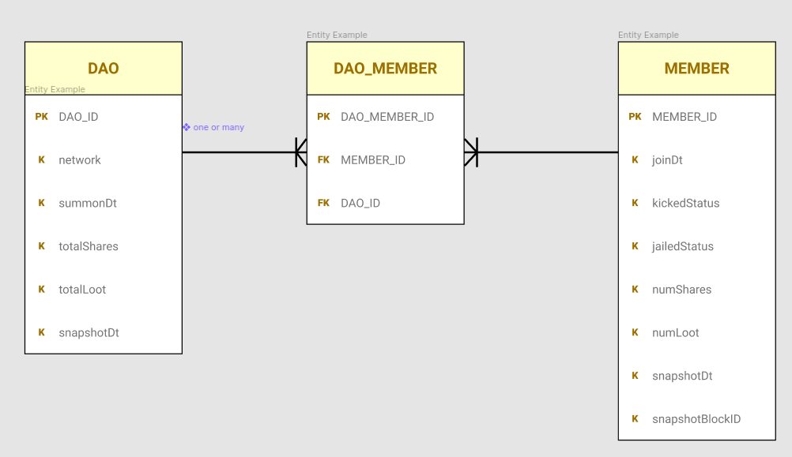

# Daohaus Data Model Testing

This repo is tracking progress of developing a data model from Daohaus subgraph data.

## Current state

Initial entities created for

1. DAO
2. MEMBER
3. DAO_MEMBER link table to enable many-to-many relationship between daos and members (one dao can have many members, and one member can belong to many daos)

## Summary of files

`data`: 5 days worth of data for 3 daos from the Daohaus subgraph. Each `.json` file is one dao data for one day.

`db.py`: script that parses json files and inserts them into a SQL database

`chainverse.db`: simple database that will be used to test data model and relationships.

# Running the Python script

The `requirements.txt` file contains all the packages you need to run the program.

To create a virtual environment

`python3 -m venv ~/.env/chainverse`

To run the virtual environment

`source ~/.env/chainverse/bin/activate`

To install packages from `requirements.txt`

`python3 -m pip install -r requirements.txt`